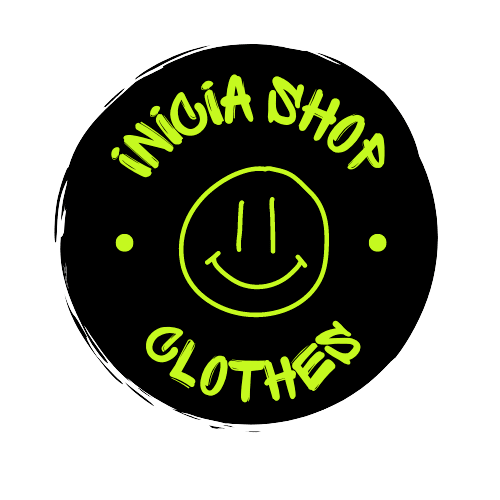
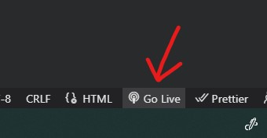
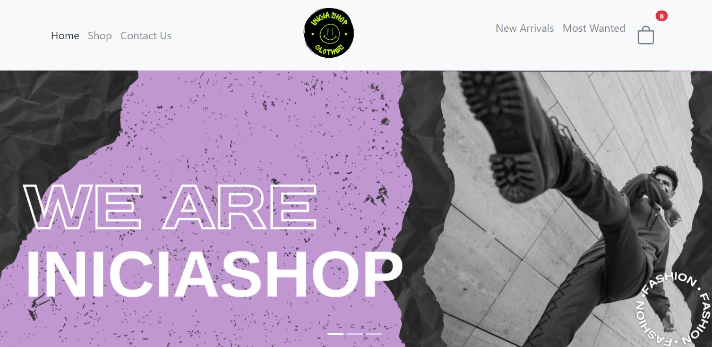
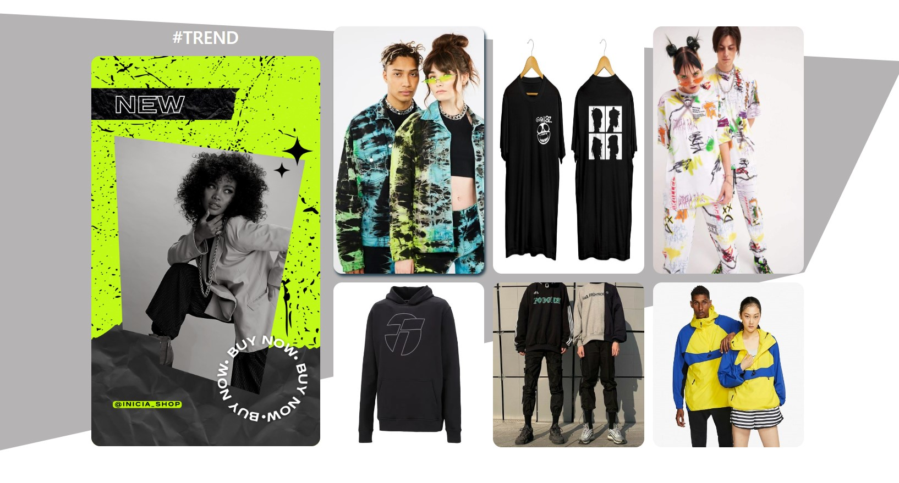
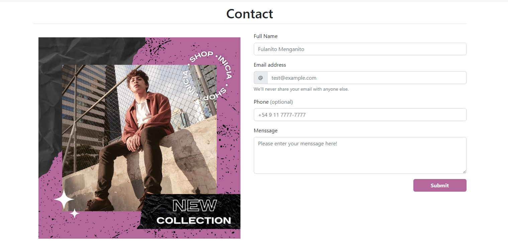
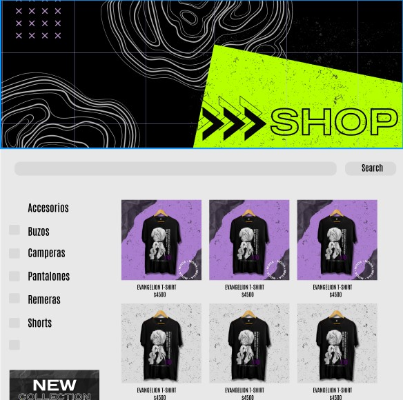
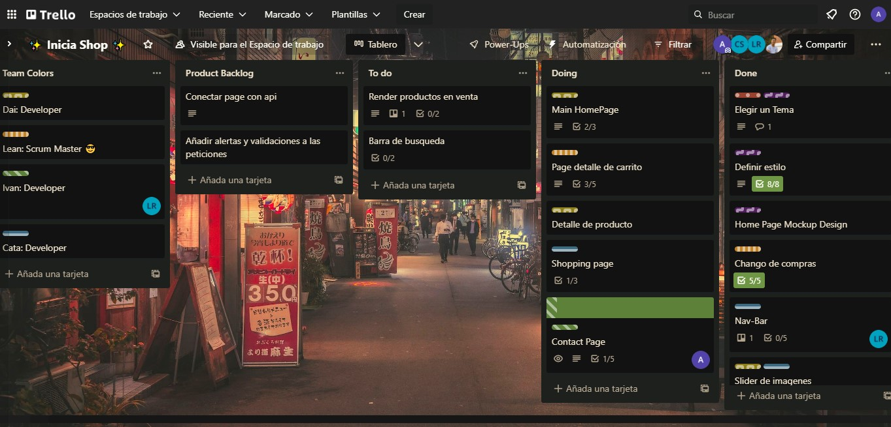

<p align="center">
  <picture>
    
  </picture>
</p>

***


### Contents 

- [Description](#description)

- [How to Use](#how-to-use)

- [Tecnologies](#tecnologies)

- [MockUp](#mockup)

- [Our team](#our-team)

# Description
## Iniciatec CheckPoint N2 - IniciaShop
Welcome to IniciaShop Clothes Inc.

It is a clothing sales business aimed at young people and a modern audience. We offer a wide range of clothing and accessories for men and women who are looking to express their unique style in every place they walk on. From graphic tees and streetwear to remarkable jackets and accessories, we have everything you need to make a fashion statement.

In addition to our clothing, we also offer a variety of shoes and accessories to complete your urban style. From sneakers and boots to hats and bags, we have everything you need to make a statement from head to toe.

Thank you for choosing Inicia Shop Clothes. We hope you find everything you're looking for and more

Inicia Shop Clothes is a Ecommerce Proyect developed for Iniciatec Bootcamp

## Color Palette
<div style="display: flex; gap: 10px; justify-content: center;">
    <div style="background-color: #C5F81E; width: 50px; height: 50px;"></div>
    <div style="background-color: #B3679B; width: 50px; height: 50px;"></div>
    <div style="background-color: #AA7DCE; width: 50px; height: 50px;"></div>
    <div style="background-color: #242424; width: 50px; height: 50px;"></div>
    <div style="background-color: #D9D9D9; width: 50px; height: 50px;"></div>
</div>
<br>

### The choice of these colors can help convey a coherent and attractive image for an urban style clothing store, and attract a young and modern audience.

<p>The main color is a bright and light green tone that can convey freshness, joy and energy.</p>
<p>The complementary light pink and purple tone can convey sweetness and sophistication. These colors add a touch of delicacy and romance to the brand.</p>

# How to use

You will need the [Live Server](https://marketplace.visualstudio.com/items?itemName=ritwickdey.LiveServer) Extension for VSC:
```
Live Server
Description: Launch a development local Server with live reload feature for static & dynamic pages
VS Marketplace Link: https://marketplace.visualstudio.com/items?itemName=ritwickdey.LiveServer
```

Then clone our repository. Type in the Git terminal:
```
git clone https://github.com/Axfroy/IniciaShop-iniciatec-checkpointN2.git
```
Next click to Go Live from the status bar to turn the server on/off.

<picture>
    
</picture>

After that the web should start running in your Local Host

# Technologies used

   

### Also complemented with 

    

## Mockup
***
### Figma
<picture>
    
</picture>
<picture>
    
</picture>
<picture>
    
</picture>
<picture>
    
</picture>

### Trello
<picture>
    
</picture>

# Our Team
| [<br><sub>Dai</sub>](https://github.com/DaiM24)|[<br><sub>Lean</sub>](https://github.com/Leandro97ramos) |  [<br><sub>Cata</sub>](https://github.com/catasimonovich4) |  [<br><sub>Ivan Ezequiel Rodriguez</sub>](https://github.com/Axfroy)
| :---: | :---: | :---: | :---: |
|<a href="https://www.linkedin.com/in/daianamercado/"></a>|<a href="https://www.linkedin.com/in/leandro-ramos-lkd/"></a>|<a href="https://www.linkedin.com/in/catalina-simonovich/"></a>|<a href="https://www.linkedin.com/in/ivane-rodriguez/"></a>

